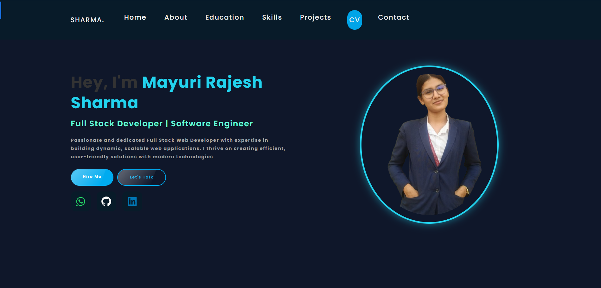
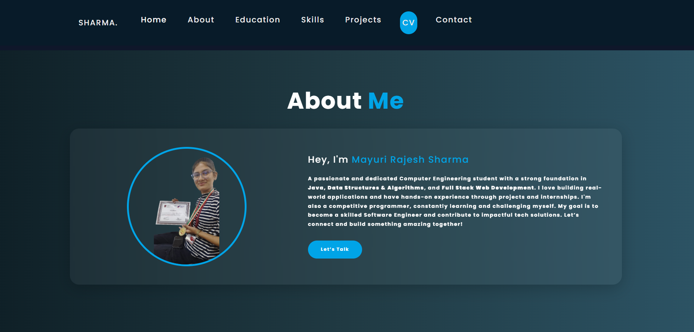

# Mayuri Sharma's Portfolio

Welcome to my personal portfolio! I'm Mayuri Sharma, a passionate software developer with expertise in Full Stack Development, Java, Data Structures, Algorithms, and more. Here, you will find all the details about my skills, projects, and experiences.

## 📌 **Live Demo**
Check out my live portfolio here:  
[Mayuri Sharma's Portfolio](https://mayuri-sharma-portfolio.onrender.com/)

## 🛠 **Technologies & Skills**
- **Frontend**: HTML, CSS, JavaScript, ReactJS, Bootstrap

## 📂 **Projects**
Here are some of the projects I've worked on:

### 1. **Employee Management System**
- **Tech Stack**: ReactJS, Node.js, Express.js, MongoDB  
- **Description**: A web-based application to manage employee records.
- **GitHub**: [Employee Management System](https://github.com/Smayuraa/employee-management-system)

### 2. **Adventure Abode**
- **Tech Stack**: ReactJS, Node.js, Express.js  
- **Description**: A travel application to book adventures and trips.
- **GitHub**: [Adventure Abode](https://github.com/Smayuraa/AdventureAbode)

## 📸 **Images**
Below are a few screenshots of my portfolio:

## 📫 **Get in Touch**
Feel free to reach out to me via the following:
- **Email**: mayurisharma@gmail.com.com
- **LinkedIn**: [Mayuri Sharma](https://www.linkedin.com/in/sharma-mayuri/)
- **GitHub**: [Smayuraa](https://github.com/Smayuraa)

Thank you for visiting my portfolio!
